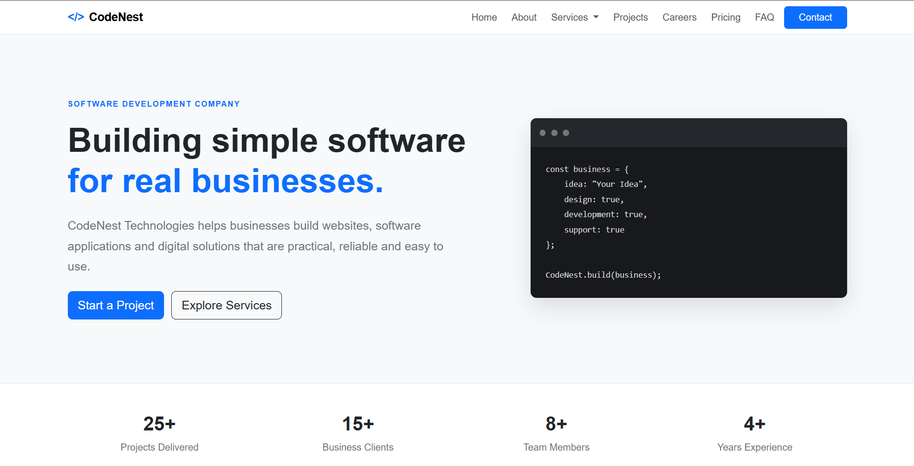

# CodeNest Technologies

A responsive multi-page business website for a fictional software development company, built using HTML, CSS, Bootstrap 5, and JavaScript.

## Live Website

https://jayakiranyedla.github.io/codenest-technologies/

## Website Preview




## GitHub Repository

https://github.com/jayakiranyedla/codenest-technologies

---

## About the Project

CodeNest Technologies is a static business website created for a fictional software company.

The website presents different software development services and provides sections for projects, pricing, careers, frequently asked questions, and contacting the company.

The project was developed as a portfolio project to practice front-end web development and create a complete multi-page business website.

---

## Features

- Responsive navigation bar
- Services dropdown menu
- Multiple service pages
- Software company information
- Project showcase
- Pricing packages
- Careers page
- FAQ section
- Contact form
- Responsive design for different screen sizes
- Custom `</>` website branding
- Custom favicon
- Simple JavaScript interactions
- GitHub Pages deployment

---

## Pages

The website contains 12 pages:

1. Home
2. About
3. Services
4. Web Development
5. Software Development
6. Mobile Development
7. Cloud Solutions
8. Projects
9. Careers
10. Pricing
11. FAQ
12. Contact

---

## Technologies Used

- HTML5
- CSS3
- Bootstrap 5
- JavaScript
- Git
- GitHub
- GitHub Pages

Bootstrap is included locally in the project instead of using a CDN.

---

## Project Structure

```text
codenest-technologies/
│
├── index.html
├── about.html
├── services.html
├── web-development.html
├── software-development.html
├── mobile-development.html
├── cloud-solutions.html
├── projects.html
├── careers.html
├── pricing.html
├── faq.html
├── contact.html
├── favicon.svg
│
├── css/
│   └── style.css
│
├── js/
│   └── script.js
│
└── bootstrap/
    ├── css/
    │   └── bootstrap.min.css
    │
    └── js/
        └── bootstrap.bundle.min.js
